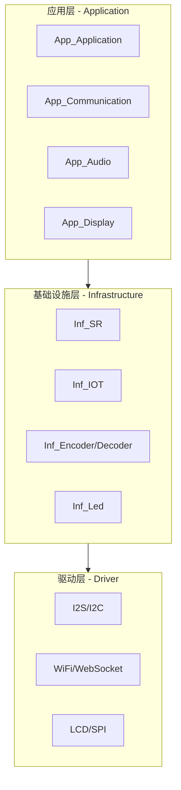
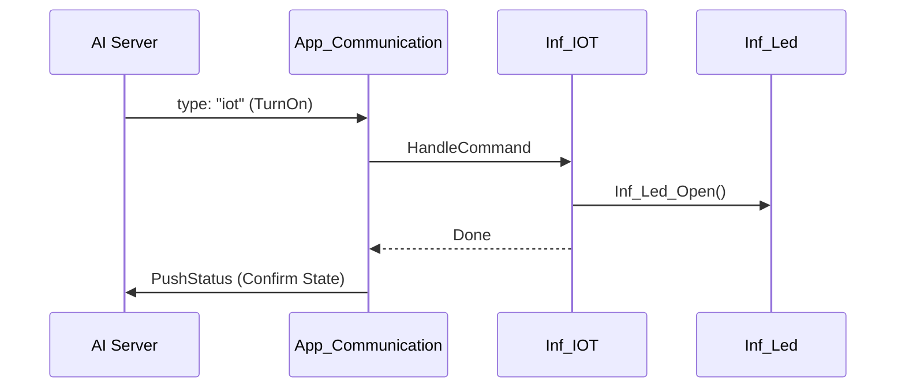

# 🤖 小智 (Xiaozhi) AI Assistant

> **基于 ESP32-S3 的智能语音助手**  
> 集成了语音识别 (SR)、流式音频传输、大模型交互 (LLM) 以及基于 MCP 协议的 IoT 设备控制功能。

---

## 🏗️ 1. 系统架构概览

项目采用分层设计，确保了硬件驱动与业务逻辑的解耦：

---

## 🧩 2. 核心模块职责

### 2.1 App 业务模块
- **`App_Application`**: 系统的“大脑”。负责初始化、全局事件管理 (`global_event`) 及模块协调。
- **`App_Communication`**: 通信中枢。处理 WebSocket、MCP 协议、Session 管理及 IoT 指令中转。
- **`App_Audio`**: 音频流水线。负责麦克风采集、SR 识别、Opus 编解码及下行音频播放。
- **`App_Display`**: UI 表现层。基于 LVGL 实现 Emoji、状态文字、WiFi 信号及二维码显示。
- **`App_OTA`**: 生命周期管理。负责设备激活、Token 获取及固件更新。

### 2.2 Inf 硬件接口层
- **`Inf_SR`**: 语音识别引擎。负责唤醒词检测 (WakeNet) 和端点检测 (VAD)。
- **`Inf_IOT`**: IoT 逻辑适配。定义设备能力描述符，解析 AI 指令并驱动硬件。
- **`Inf_Led`**: 硬件执行器。控制 RGB LED 的开关与颜色。
- **`Inf_Encoder/Decoder`**: 音频编解码。负责 PCM 与 Opus 格式的互相转换。

---

## 🔄 3. 核心逻辑流程

### 3.1 启动与激活流程
1. **WiFi 配网**: `Driver_WIFI` 启动，未配网时显示二维码。
2. **设备激活**: `App_OTA` 换取 `websocket_url` 和 `token`。
3. **建立连接**: `App_Communication` 启动 WebSocket，声明支持 `mcp`。
4. **同步上下文**: 收到 `hello` 后，通过 `App_Communication_PushStatus` 同步状态。

### 3.2 音频数据流

**上行 (录音):**
> `I2S 采集` ➔ `VAD/唤醒检测` ➔ `Opus 编码` ➔ `WebSocket 发送`

**下行 (播放):**
> `WebSocket 接收` ➔ `Opus 解码` ➔ `I2S 播放 (ES8311)`

### 3.4 IoT 控制逻辑 (MCP)

---

## 💾 4. 内存与存储设计

### 4.1 内存分配 (PSRAM)
项目大量使用外部 PSRAM (`MALLOC_CAP_SPIRAM`) 以应对高负载：
- **RingBuffer**: 所有音频流缓冲区。
- **LVGL**: 渲染缓冲区及任务堆栈。
- **Codec**: 编解码临时缓冲区。

### 4.2 Flash 分区 (`partitions.csv`)
| 分区名 | 类型 | 大小 | 用途 |
| :--- | :--- | :--- | :--- |
| **nvs** | data | 24K | 存储 WiFi 信息、UUID 及配置 |
| **phy_init** | data | 4K | 射频校准参数 |
| **factory** | app | 4M | 应用程序固件 |
| **model** | data | 300K | 语音识别声学模型数据 |

---

## 🚀 5. 关键技术点

*   **VAD 状态机**: 自动录音切换，优化带宽利用率。
*   **异步桥接**: `ws-mcp-bridge.js` 实现本地 stdio 与远程 WSS 的无缝转换。
*   **线程安全**: 严格的 `lvgl_port_lock` 机制，保障多任务 UI 稳定性。

---

  <i>Xiaozhi Project - 打造最懂你的 AI 硬件</i>

